# 🧰 Sandbox Ideas 🪣🔨

## 🌐 Off-Grid Exploration

- Players can choose to **explore the wilds without a known target town**.
- Doing so sends them toward **random off-grid towns** that normally aren't part of the standard travel routes.
- The player must keep wandering until they **randomly reconnect to the main grid** (approx. **20% chance** per departure).
- This adds unpredictability, variety, and lets them discover towns they would **never normally encounter**.

### Optional Upgrade Tie-In — *MitTech Exploration Memory*

- Upgrading the MitTech Glove with **Exploration Memory** logs every off-grid town discovered.
- Saved towns can then be **routed to intentionally** from any town before leaving.
- Exploration transitions from random wandering into a **strategic layer**, letting players build their own network of hidden towns.

### Why This Works

- Keeps travel fresh — no repetitive loop of the same main-grid towns.
- Creates “I found this weird town once but can’t find it again” mystery.
- Rewards exploration and supports long-term progression.
- Lets players **shape their own world routes** over time.

---

## 🌐 Node-Based Door & Town System (as an update maybe?)

1. **Nodes = Towns / Unsafe Zones**

   - Each node are the `Town`.
   - Unsafe zones are the **paths between towns**.

2. **Distance-Weighted Door Generation**

   - Each unsafe zone determines doors based on:

     - **Distance to nearest towns**
     - **Difficulty scaling** (farther = higher tier / rarer loot)
     - **Player progression** (early zones = easier, later zones = harder)

   - Example: Player might traverse **2–5 unsafe zones** before a town door appears.

3. **Dynamic Door Count**

   - Each unsafe zone randomly offers **3–4 doors**, weighted by:
     - Proximity to towns (closer → fewer doors, farther → more branching)
     - Random exploration factors

   - Doors can lead to:
     - Another unsafe zone (like the usual)
     - A main-grid town (as specified before entering wildland like the usual)
     - A hidden off-grid town by chance (new)

4. **Hidden off-grid town**

   - MitTech upgrade and logging lets the player eventually **navigate efficiently through hidden towns**.

5. **Gameplay Benefits**

   - No fixed expedition length — each run feels unique.
   - Distance-based logic naturally balances risk and reward.
   - Players feel more agency, especially combined with MitTech upgrades for mapping.

6. **Example Mermaid Node-map Diagram**

```mermaid
graph TD
    %% Main grid towns
    TownA[🏠 Town A]
    TownB[🏠 Town B]
    TownC[🏠 Town C]
    TownD[🏠 Town D]
    TownE[🏠 Town E]
    TownF[🏠 Town F]
    TownG[🏠 Town G]
    TownH[🏠 Town H]
    TownI[🏠 Town I]

    %% Off-grid towns
    Hidden1[🥷 Hidden Town 1]
    Hidden2[🥷 Hidden Town 2]
    Hidden3[🥷 Hidden Town 3]
    Hidden4[🥷 Hidden Town 4]
    Hidden5[🥷 Hidden Town 5]
    Hidden6[🥷 Hidden Town 6]
    Hidden7[🥷 Hidden Town 7]
    Hidden8[🥷 Hidden Town 8]

    %% Connections (paths / unsafe zones) with distances
    TownA ---|3| TownB
    TownB ---|2| TownC
    TownC ---|4| TownD
    TownD ---|3| TownE
    TownE ---|5| TownF
    TownF ---|4| TownG
    TownG ---|3| TownH
    TownH ---|6| TownI

    %% Cross-connections between main towns
    TownA ---|7| TownC
    TownB ---|5| TownD
    TownC ---|6| TownE
    TownD ---|4| TownF
    TownE ---|7| TownG
    TownF ---|5| TownH
    TownG ---|6| TownI

    %% Off-grid connections from main towns
    TownB ---|5| Hidden1
    TownC ---|6| Hidden2
    TownD ---|4| Hidden3
    TownE ---|7| Hidden4
    TownF ---|5| Hidden5
    TownG ---|6| Hidden6
    TownH ---|4| Hidden7
    TownI ---|7| Hidden8

    %% Connections between hidden towns
    Hidden1 ---|2| Hidden2
    Hidden2 ---|3| Hidden3
    Hidden3 ---|2| Hidden4
    Hidden4 ---|3| Hidden5
    Hidden5 ---|2| Hidden6
    Hidden6 ---|3| Hidden7
    Hidden7 ---|2| Hidden8
    Hidden1 ---|5| Hidden4
    Hidden2 ---|6| Hidden5
    Hidden3 ---|4| Hidden6
    Hidden4 ---|5| Hidden7
    Hidden5 ---|3| Hidden8

    %% Cross-connections hidden ↔ main
    Hidden1 ---|6| TownD
    Hidden2 ---|5| TownF
    Hidden3 ---|7| TownG
    Hidden4 ---|4| TownH
    Hidden5 ---|5| TownB
    Hidden6 ---|6| TownC
    Hidden7 ---|4| TownE
    Hidden8 ---|7| TownA
```

- 🏠 = main-grid town
- 🥷 = off-grid / hidden town
- Lines (`---`) = unsafe zones / paths, numbers are their distance (minum wildlands passing before chance to see town)

---